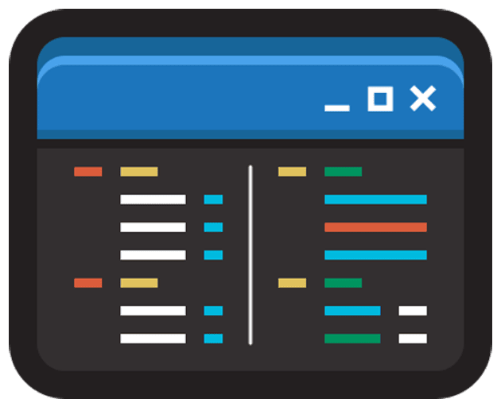

    

    The next-generation <strong>IDE</strong> for lightning-fast, 
    <strong>multi-language</strong> development with advanced <strong>productivity tools</strong>

    
    
    
     
    
    
    

## 📖 About Unitor

**_Unitor_** is the next-generation _IDE (Integrated Development Environment)_ designed to accelerate your development process with lightning-fast performance and support for multiple programming languages. Built with advanced productivity tools, it aims to enhance your coding experience and streamline your workflow.

**_Unitor_** is designed for developers who value simplicity, efficiency, and the ability to work on different projects within a single environment. The IDE combines powerful features and an intuitive interface to provide a seamless development experience that adapts to your unique needs. By harnessing its potential, you'll be able to focus on what matters most—crafting high-quality code with ease.

## 👥 Support

If you need assistance or have any questions regarding **_Unitor_**, please refer to the [Support Policy](https://github.com/bilbilak/unitor/blob/main/docs/SUPPORT.md) for information on how to get help. We also welcome suggestions and ideas for new features or improvements.

## 🤝 Contributing

We encourage contributions from the community to help improve **_Unitor_** and keep the project moving forward. If you're interested in contributing, please refer to the [Contribution Guide](https://github.com/bilbilak/unitor/blob/main/docs/CONTRIBUTING.md) for guidelines on how to participate in this project.

## ⚖️ License

> Copyright © 2023–2024 [The Artifex (4r7if3x)](https://github.com/4r7if3x)

**_Unitor_** is distributed under the terms of the [GNU Affero General Public License version 3](https://github.com/bilbilak/unitor/blob/main/LICENSE.md). Unless it is explicitly stated otherwise, any contribution intentionally submitted for inclusion in this project shall be licensed as _AGPLv3_, without any additional terms or conditions.

## 🛡️ Trademark

The name of this project, **Unitor™**, and its associated logo are subject to trademark rights. Despite the open-source nature of the project, these rights apply—even if the trademark is not registered. If you wish to reference this name or employ the associated branding elements, please refer to our [Brand Guidelines](https://github.com/bilbilak/unitor/blob/main/docs/BRAND_GUIDELINES.md).
